<p align="center">
  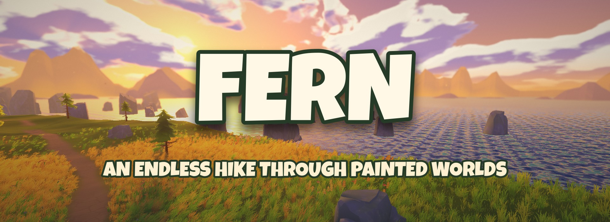
</p>

<p align="center">
  <b>An endless, cozy hiking game through hand-painted-looking nature.</b><br>
  Walk one never-ending trail through twelve biomes, solve physical problems with ropes, logs and knots,<br>
  and see how far you get.
</p>

<p align="center">
  <a href="https://github.com/Marne404/fern/releases/latest"><b>⬇ Download for Windows / Linux</b></a> ·
  <a href="https://marne404.github.io/fern/"><b>🌿 Website</b></a> ·
  <a href="docs/GAME_DESIGN.md">Game design</a> ·
  <a href="docs/DEVLOG.md">Devlog</a>
</p>

---

<p align="center">
  
</p>

<p align="center">
  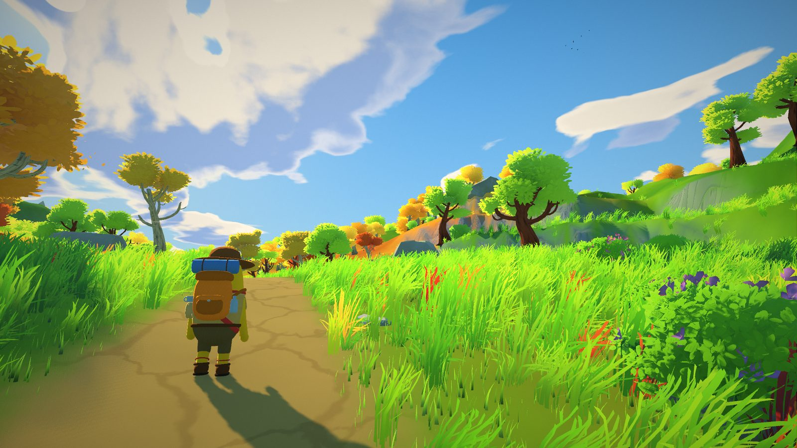
  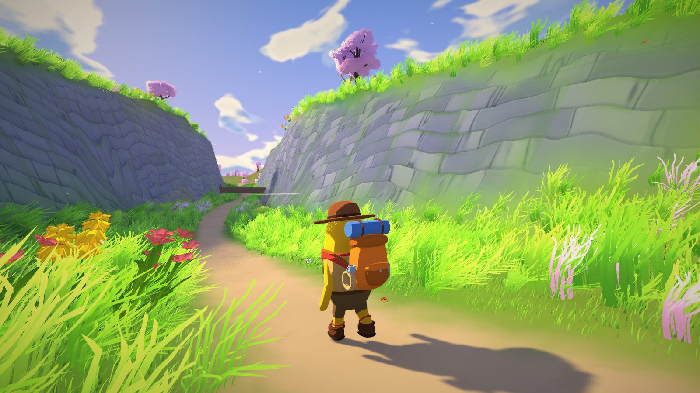
  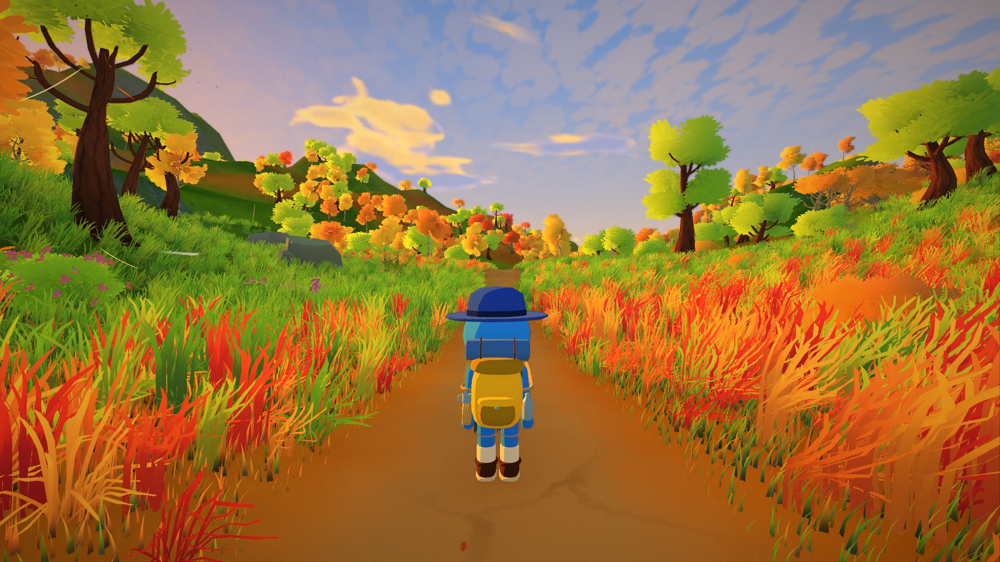
  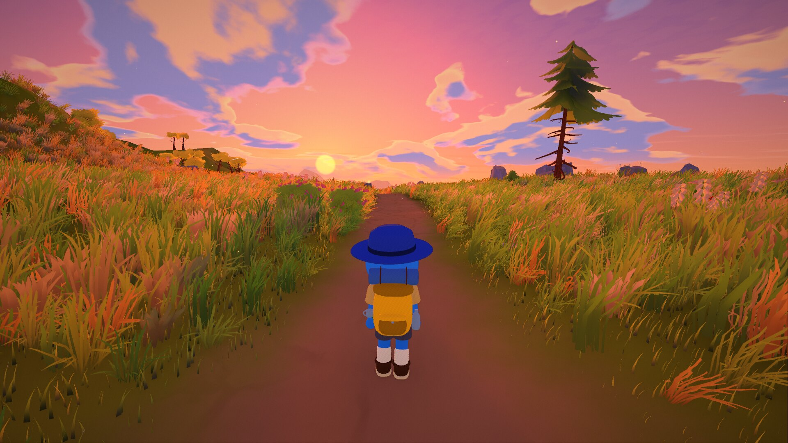
  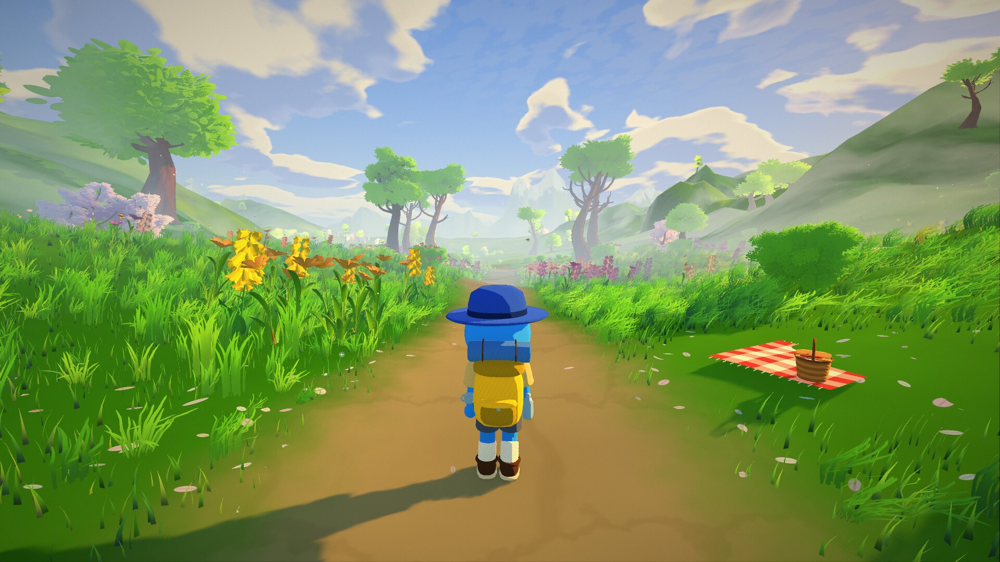
  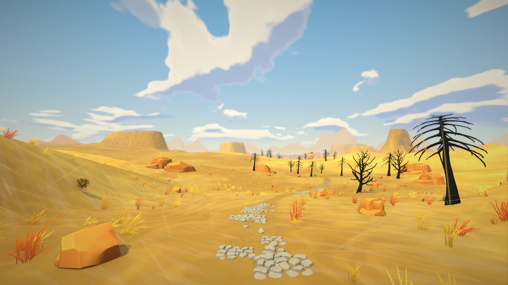
  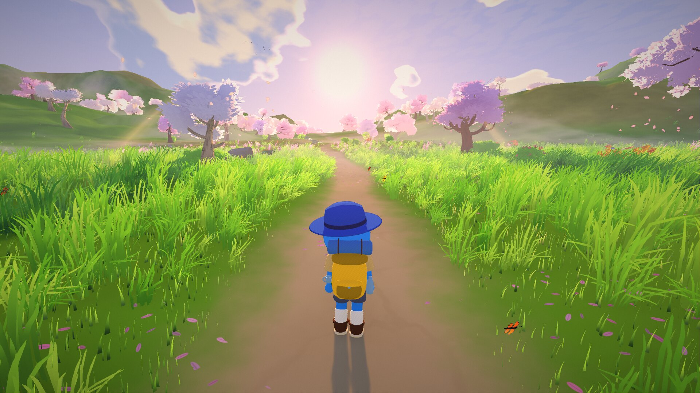
  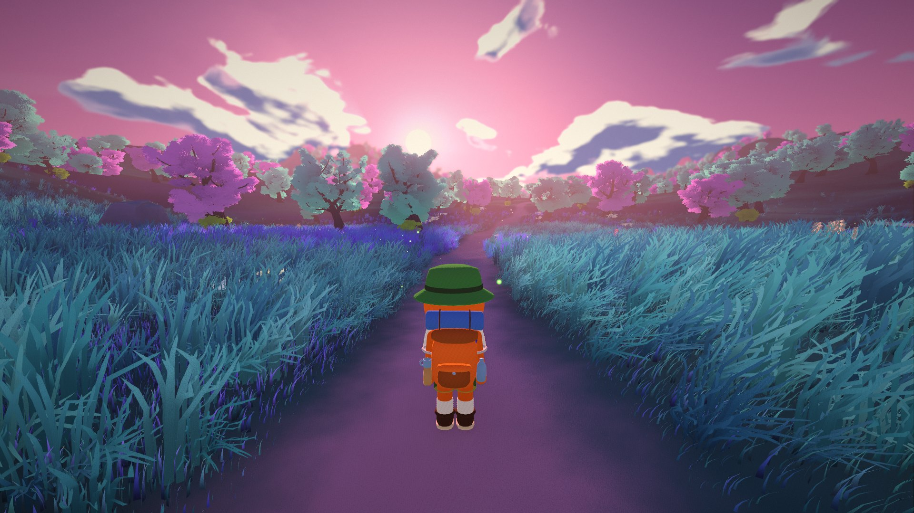
  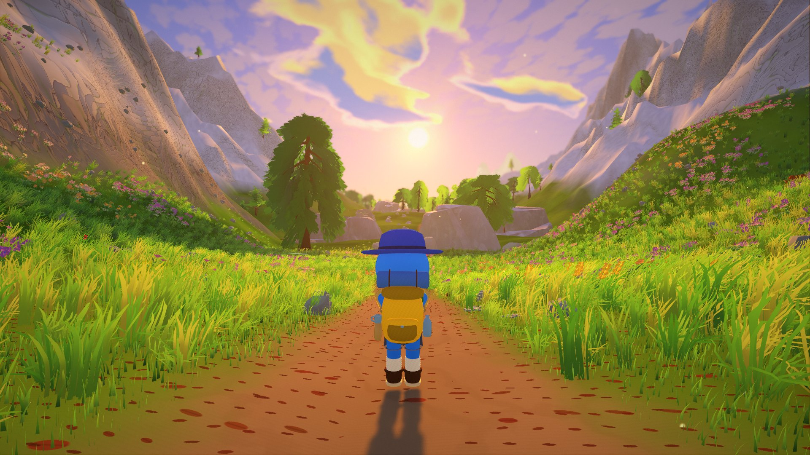
  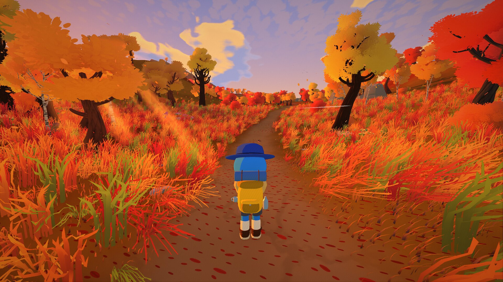
</p>

## What is Fern?

Fern is a walking game about the journey, not the destination. The path never ends – your distance is your score.
Most of the time you just walk, look around and fall in love with the landscape. Every now and then the world puts a
real, physical problem in your way, and there is no scripted solution:

- **A river with a broken bridge** – push a log across and balance over it, swim through the current (and get your
  backpack wet), or knot two ropes together, stretch them between the posts and climb across.
- **A giant fallen tree** at the end of a narrowing gorge – crouch underneath (not with a heavy backpack!) or climb over.
- **A cliff with a waterfall** after a long climb – jump into the pool, rappel down on a rope, or take the long way round.

You hike as a **scout**: a round little hiker with noodle arms, a merit-badge sash and a backpack that is always a
bit too big. Pick colors, a hat and a face in the main menu (*Your scout*). Your scout walks ahead of the camera on the
title screen, and **V** switches between first and third person on the trail.

Fern is a single-player prototype of a planned co-op game (see the [game design](docs/GAME_DESIGN.md)).

## Features

- **Your scout** – customizable hiker (10 colors, 8 uniforms, 5 hats, 4 faces) with procedural animation: walking,
  running, crouching, sitting, swimming, climbing, flailing through the air, waving; faces react to exhaustion and sleep.
- **Endless, seed-based world** – type any word or number as your world seed and share it with friends.
- **12 biomes** that blend smoothly: Autumn Meadow, Spring Meadow, Forest Trail, Red Maple Wood, Blossom Grove,
  Mountain Pines, Cliff Lands, Sunset Coast, Lake Country, Deadwood Bog, Glowing Forest and Desert Valley.
- **A living landscape** – a winding trail with long climbs and descents, forested hills and mountain ranges,
  endless dunes with mesas, ponds, rivers, waterfalls, landmarks like rock arches and ruins.
- **Weather and wind** – gusts roll through the grass, colorful trees drop their leaves, tumbleweeds bounce through
  the desert, dust devils wander past and small sandstorms blur the horizon.
- **Body and backpack** – stamina, hunger, thirst, tiredness, felt temperature and luggage weight. 20 items with
  properties (waterproof, fragile, perishable, …). Swimming soaks what isn't waterproof; cameras break.
- **Physics obstacles** – pushable, floating logs, ropes with a knot minigame (knot quality decides whether it holds),
  rappelling, fall damage (water breaks your fall).
- **Dynamic music** – 56 tracks; every biome has its own playlist, tension music near obstacles, calm music while resting.
- **Anime-style rendering** – real grass blades, painted clouds, stylized water, film-look grading, sun shafts.
  Presets from Low to Ultra, every optimization can be toggled individually.

## Controls

| Key | Action |
|---|---|
| **WASD** / mouse | walk / look around |
| **Shift** | run |
| **Space** | jump · climb over logs · pull yourself up ledges |
| **Ctrl** | crouch |
| **E** | pick up · use · drink · interact |
| **Tab** | open backpack |
| **R** | rest (sleep when tired) |
| **V** | first / third person |
| **Mouse wheel** | camera distance (third person) |
| **Right mouse** | binoculars |
| **Q** | untie rope |
| **Esc** | pause / menu |
| **F12** | screenshot |
| **F6 / F7** | debug: fly / noclip |

## Play it

Download the latest build from **[Releases](https://github.com/Marne404/fern/releases/latest)**, unzip it and
run `Fern.exe` (Windows) or `Fern.x86_64` (Linux). No installation needed. Windows may warn about an unknown
publisher – click *More info → Run anyway*.

On first start the game picks *Medium* for integrated graphics and *High* otherwise; you can change everything in
**Settings**. Reference: Radeon iGPU at 1080p – Medium ≈ 66 FPS, High ≈ 29 FPS.

## Running from source

Fern is built with **[Godot 4.7](https://godotengine.org/)** (Forward+). Open the folder in the editor and press F5,
or run `godot --path .`. The world is generated at runtime, so `main.tscn` looks empty in the editor.

> **Note:** the music is licensed for use in the game only and may not be redistributed as files, so it is **not**
> part of this repository. The game runs fine without it (silently); the released builds include it.

### Project layout

```
scripts/main.gd                   game flow (menu, hiking, pause), records
scripts/core/settings.gd          autoload: quality presets, dynamic resolution, saving
scripts/world/world_gen.gd        path, heights, hinterland, biomes, obstacles (thread-safe)
scripts/world/biome_defs.gd       all biomes as data (terrain, atmosphere, scatter layers)
scripts/world/chunk_builder.gd    chunk data on worker threads
scripts/world/chunk_manager.gd    streaming, nodes, collision, floating origin
scripts/world/atmosphere.gd       sky, sun, fog, biome blending
scripts/world/grass_field.gd      grass blade carpet around the camera (High/Ultra)
scripts/world/poi_manager.gd      finds along the trail
scripts/world/landmark_manager.gd rock arches, ruins, stone circles, lookout rocks
scripts/obstacles/                rivers, fallen trees, cliffs, ropes, waterfalls
scripts/player/                   player character, scout model and animation, body state
scripts/items/                    items, backpack, world items
scripts/audio/                    music director and track list
scripts/fx/                       wind gusts, leaf fall, desert effects, birds, butterflies, backdrops
scripts/ui/                       HUD, menus, backpack, knot minigame
scripts/tests/                    automated tests (obstacles, body/backpack)
shaders/                          terrain, foliage, grass, water, sky, rocks, post effects
```

A new biome is one more function in `biome_defs.gd` plus an entry in `all()`.

### Tests and debug flags

Command-line options after `--`, e.g. `godot --path . -- --play --z=-15000`:

`--play` start hiking right away · `--z=-7000` start position (forward = negative) · `--seed=2` · `--autowalk` ·
`--timescale=6` · `--fps` console stats · `--preset=High` / `--set=veg_density:0.5` (not saved) ·
`--shot=image.png --wait=300 --size=1920x1080` save a screenshot and quit (`--ui` with interface) ·
`--fly=5 --look=-15 --lookrel=dx,dz` raised test camera · `--gust=0.8` fixed gust · `--devil` dust devil ahead ·
`--debugfx` weather state · `--biomes` / `--pois` / `--ponds` / `--landmarks` print lists · `--music` log track changes ·
`--third` third person · `--scout` open the scout editor · `--pitch=-10 --yaw=15` camera angle at the start ·
`--obstacles` print obstacle positions ·
`--obtest` obstacle test (31 checks) · `--selftest` body/backpack test.

Standalone tools: `godot --path . -s res://scripts/tests/scout_studio.gd -- --mode=lineup --out=x.png` renders scouts
(modes `lineup`, `poses`, `face`, `back`, `walk`, `side`, `group`), `scripts/tests/scout_export.gd` exports the scout
as `docs/models/scout.glb` for the website.

## Credits

- **3D models:** [Quaternius](https://quaternius.com/) – Stylized Nature MegaKit (CC0)
- **Music:** AlkaKrab – Fantasy Ambient, Desert, Fantasy RPG Vol. 2, Fairytale Magical Fantasy (licensed for games)
- **Scout design:** inspired by the hikers of PEAK (Aggro Crab & Landfall); the model itself is made from scratch
- **Font:** [Luckiest Guy](https://fonts.google.com/specimen/Luckiest+Guy) by Astigmatic (Apache 2.0)
- **Engine:** [Godot Engine](https://godotengine.org/) (MIT)

See [CREDITS.md](CREDITS.md) for details.

## License

© 2026 Marne Kismann. **All rights reserved.** The source code and assets made for Fern may be viewed on GitHub,
but not copied, modified, redistributed or used in other projects without written permission. Third-party assets
keep their own licenses (see [CREDITS.md](CREDITS.md)). See [LICENSE](LICENSE).
