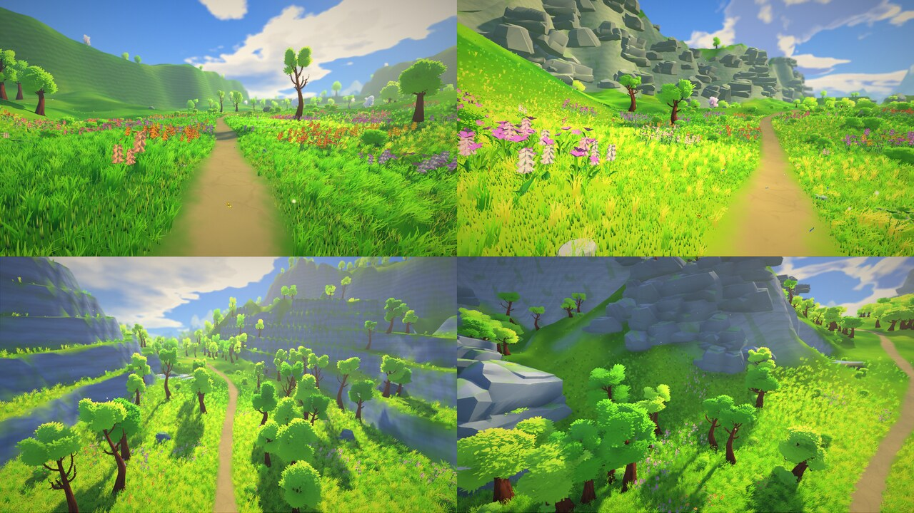
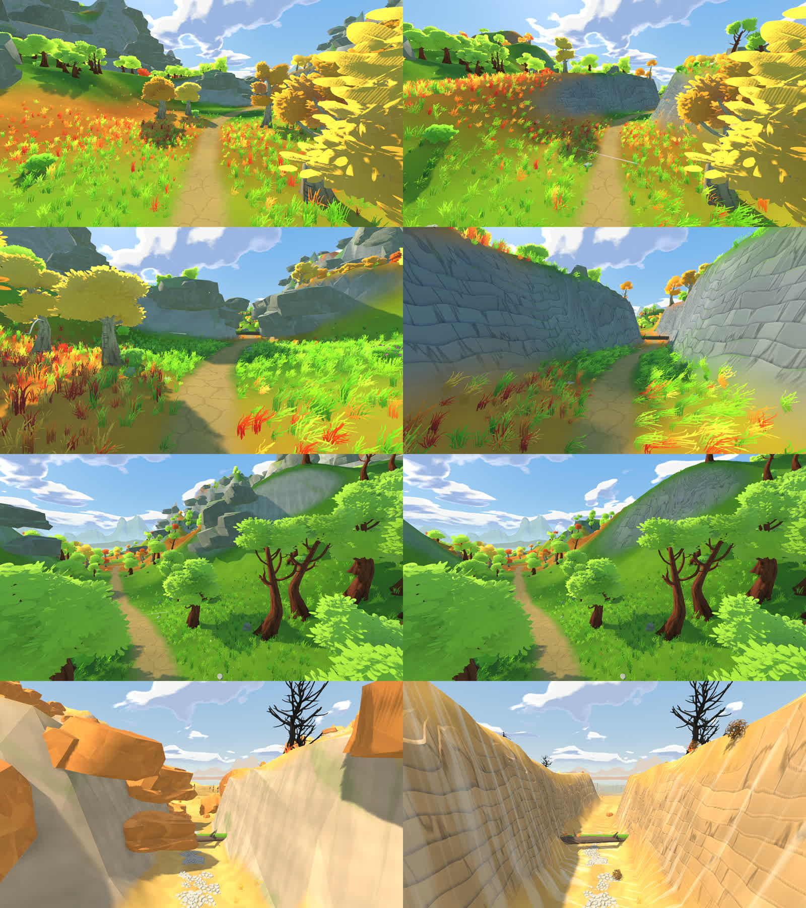
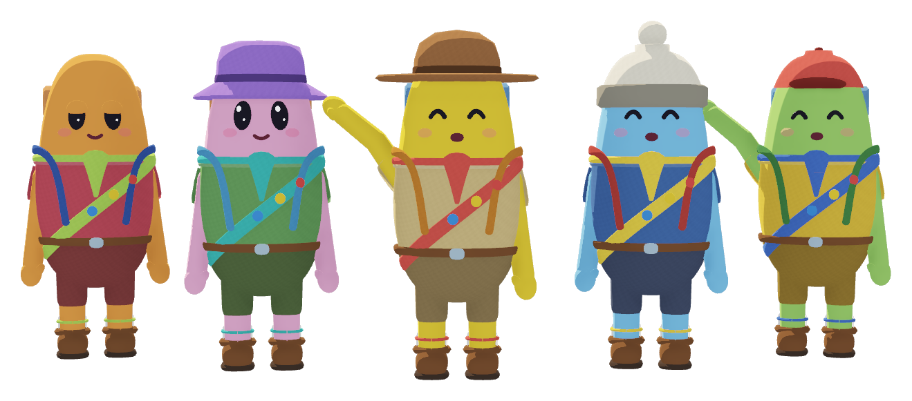

# Fern – Devlog

How the prototype grew, round by round. Every step was checked with renders from several perspectives and with the
automated tests (`--obtest`, `--selftest`).

---

## Round 1 – Style prototype and endless world (M0, M1)

- Three fixed landscapes to find the look: stylized foliage, bark and rock shaders, anime sky, wind.
- Then the endless world: an infinite, seed-based trail, biomes with smooth transitions, 64 m chunks streamed on
  worker threads (two LOD levels, MultiMesh vegetation, collision), floating origin every 1024 m,
  quality presets, main menu with a camera flight, first-person hiker with stamina, distance as the score.

## Round 2 – Body, backpack and the "paradise" Ultra mode (M2)

**Body and backpack:** hunger, thirst, tiredness, felt temperature (biome, clothing, wetness, movement), injuries and
luggage weight act on maximum stamina; only the state (Fit → Exhausted → Weak → Collapsed) is visible.
20 items with weight and properties; eat, drink, wear, throw, drop. Finds along the trail: picnic, lost backpack,
bench, spring, chest, berry bush, rare curiosities, signposts with absurd destinations.

**Ultra "paradise" mode** – goal: on strong PCs Fern should look like a still from a Ghibli or Makoto Shinkai film.

| # | Building block | Presets |
|---|---|---|
| 1 | Grass blade carpet (tiles around the camera, 2 m patches, two LOD levels, exact ground height, path and pond cut-outs, player interaction) | High: normal · Ultra: paradise |
| 2 | Anime grass shader (gradient, sheen, translucency, wind waves, clumps, distance transition) | with 1 |
| 3 | Anime lighting for trees, bushes and grass (cool shadows, rim light) | all |
| 4 | Film-look shader (grading, vignette, grain) + optional outlines | High/Ultra |
| 5 | Rainbow, silver linings on clouds | all |
| 6 | Ultra: SSIL, depth of field, softer shadows, thin volumetric fog everywhere | Ultra |
| 7 | New settings: grass blades, film look, outlines, indirect light, depth of field | – |

Knobs for Ultra if it's too slow on strong GPUs: "Dense" instead of "Paradise" grass (`GrassField.LEVELS`),
radii of the blade tiles, shadow level, SSIL.

## Round 3 – Performance

All optimizations can be toggled individually in **Settings → Performance optimizations**, none of them is visible.
GPU time Medium 24.1 → 20.0 ms, Ultra ~98 → 87.5 ms on a Radeon iGPU (all off: High 36 → 52 ms).

- Instances batched in sub-cells (trees/rocks 32 m, grass/details 16 m): more precise frustum culling, LOD per cell.
- Grass tufts without alpha test (own shader, the texture is opaque) → early depth test.
- Leaf masks without anisotropic filtering, merged wind samples, per-vertex color variation.
- Tiny objects (pebbles, path stones, tree mushrooms, small stones) cast no shadows.
- Sun shafts with 16 instead of 24 samples, screen copies without mipmaps.
- Ultra: shadow filter "medium" instead of "high" (−12 ms, not visible in comparison).
- Grass blade tiles with a 3 ms time budget per frame (no hitches while walking).
- Distant chunks batch their plants per chunk (draw calls High 3021 → 2556).

Tested and discarded: disabling the depth prepass (27 instead of 20 ms), random jitter in the sun shafts
(+6 ms from bad cache use), thinning grass tufts near the camera (no measurable gain).

## Round 4 – Genshin look, obstacles and more world

**Bug hunt:** trees got the real hull of their lower trunk as collision instead of a cylinder; fixed bare distant
trees (LOD threw away leaf cards), floating sea stacks, over-bright glowing mushrooms, path texture on vertical
cliffs, dark anime outlines (now subtle colored silhouettes at big edges only), a second journey starting on Space,
physics objects falling through the ground before collision was loaded, test runs writing records.

**4 new biomes:** Sunset Coast (sea, sea stacks, sunset), Cliff Lands (terraces), Glowing Forest (dusk, fireflies,
glowing mushrooms), Lake Country. Giant trees as landmarks, aerial perspective.

**Obstacles – "the world poses physical problems, there is no intended solution":**

| Obstacle | Solutions |
|---|---|
| Fallen tree across the path | crouch underneath (a backpack over 12 kg gets stuck) · climb over (stamina, impossible over 16 kg) |
| River with a broken bridge | push a log (slow alone) and balance over it (weight acts as a lever) · swim (the current drifts you, the backpack gets wet; a short log is a trap) · knot two 10 m ropes, tie them to the posts, carry the end across, stretch it and climb across (a weak knot plus heavy load loosens) |
| Cliff with a waterfall pool | jump (the water breaks the fall) · fall onto the ground (damage, fragile items break) · rappel · side ramp as a detour |

Plus: knot minigame with quality in %, the field guide shows the sequence permanently (without it only for 2 seconds),
pulling yourself up ledges.

**Music, light, water:** 44 tracks sorted by mood with crossfades and measured loudness; the "blinding sun" turned out
to be a veil of sun shafts, fog scattering and backlight – fixed. Natural grass without square cells, irregular pond
shores with sandy rims, winding rivers, an underwater effect, real 3D waterfalls with foam and spray, rocks only on
reasonably flat ground, grove structure with clearings, landmarks (rock arches, ruins, stone circles, lookout rocks).

## Round 5 – Debug freecam and world fixes

- **Debug freecam:** F6 flying with collision, F7 noclip.
- **Steep edges:** slopes over 40° are no longer ground → you slide off. Stepping up works up to 30 cm.
- **Narrow at the fallen tree:** a 34 m giant trunk (Ø 1.4 m) spans a rock gorge – no walking around it.
- **Rivers** limited to ±85–115 m: a waterfall out of the rock wall upstream, a rock barrier downstream.
- **No grass inside rocks**, not even from neighboring chunks.
- Seed selection in the main menu, all optimizations optional, Genshin-style painted cumulus clouds.
- Obstacle test extended to 31 checks – all passed.

## Round 6 – Terrain and music

- The trail winds in wide bends (up to ~20° per 100 m) with long climbs and descents.
- The valley sides are natural hills with bays, ridges and knolls instead of uniform walls.
- Before every cliff the trail climbs ~300 m, then a 16–22 m drop with a waterfall.
- **Music:** 56 tracks; every biome has its own playlist. Near obstacles, on a rope, in the current and when
  collapsing it switches to tension music, when resting to calm parts, when swimming to water music.

## Round 7 – Hinterland, sunken lane and weather

- **Hinterland:** instead of rock walls at the corridor edge the land continues naturally – forested hills and
  mountain massifs alternating with open side valleys, rocky peaks in mountain biomes, endless dunes with mesas in
  the desert. A soft boundary (you get slower and are gently pushed back) replaces the wall.
  No more randomly scattered giant boulders on the slopes.
- **Rock walls** have real strata of varying thickness with ledges, overhangs, cracks and moss, in the biome's color
  (sandstone in the desert).
- **Sunken lane:** ~180 m before a fallen tree, grassy banks slowly close in and grow; right before the trunk they
  become rock walls.
- **Weather:** wind gusts everywhere; tumbleweeds, dust devils, sand streamers, drifting sand veils and haze in the
  desert; colorful trees shed leaves and blossoms in their own color.
- Performance went up (Medium 54 → 66 FPS, High 26 → 29 FPS at 1080p on the iGPU).

## Round 8 – Fern

- Renamed to **Fern**, everything translated to English (UI, items, messages, code comments, docs).
- Luckiest Guy as the display font, a game icon, Windows and Linux builds, this repository and website.

## Round 9 – Your scout and a new website

- **The scout:** a playable hiker inspired by the scouts of PEAK – bean-shaped body, dot eyes, noodle arms, short
  legs, uniform with neckerchief and merit-badge sash, a big backpack with bedroll, bottle, mug and rope. Modeled
  entirely in code (`scout.gd`, `mesh3.gd`) with its own cel shader.
- **Procedural animation:** walking, running, crouching, sitting, lying, swimming, climbing, PEAK-style flailing in the
  air and waving; springs on arms, backpack and hat; blinking, glancing, faces for exhaustion, sleep and collapse.
- **Third person** with **V** (spring-arm camera, mouse wheel zoom); in first person you see your scout's shadow.
- **Main menu:** your scout hikes ahead of the camera; *Your scout* opens an editor (colors, uniform, hat, face) –
  the camera flies around to the front and the scout waves.
- Static parts are merged into one mesh per animated node (~20 instead of ~90 draw calls).
- **Website:** a live three.js diorama of the trail built from the game's models – switch biomes (leaves, petals,
  sand and tumbleweeds, snow, fireflies), follow your scout, click it to make it hop – plus the scout editor in 3D,
  new third-person screenshots of the obstacles and biomes.

## Round 10 – PEAK-style scout, field guide UI, new biomes and obstacles

- **The scout, again:** rebuilt after reference pictures of PEAK – round head on a short body, big dot or sclera
  eyes with lids and brows, many mouths, shirt with collar and shorts, sash, eight hats, glasses and neckerchiefs.
  More expressive animation: idle fidgets, landing squash, flailing, scared/cold/effort faces.
- **Emotes:** a radial wheel on **G** with 16 gestures and expressions (no dances), configurable slots.
- **Voice groundwork:** microphone detection with push to talk, always on and voice activation, a level meter, and
  lip sync for your own scout (unless an emote is playing). Nothing is sent yet.
- **UI in the style of PEAK:** Nunito and Luckiest Guy, paper cards with hard shadows, settings in tabs; a HUD with a
  stamina bar that shows what drains you (hunger, thirst, tiredness, cold, injury) as hatched segments; prompts
  with keycaps; a backpack screen with a slot grid and item details.
- **Items:** 50 hand-modeled items with icons (30 new: cheese, honey, cocoa, sunscreen, boots, compass, lantern,
  kite, harmonica, fortune cookie …) and effects; structures and finds got proper models.
- **World:** a real ocean (no more endless tiled water), wet shores, fallen leaves, petals and needles on the path,
  footprints, dust puffs and footstep sounds, water rings from your steps and rising fish, higher settings for view
  and grass distance (new *Extreme* preset).
- **Three new biomes:** Lavender Hills (procedural lavender rows), Birch Wood and the misty Heather Highlands with
  drizzle. **Three new obstacles:** a pasture fence with a stile, a mud hollow with stepping stones, a rockslide.
- **Performance:** level of detail for distant trees and their shadows (visibility ranges); measurements and dropped
  ideas in `plans/round10.md`.

## Round 11 – A living day

- **Impostors:** distant trees are baked in the background into 8 views (albedo, normals, bark mask) and drawn as
  billboards lit like the crowns; every tree hands over at its own distance. Ultra −6 ms, Extreme −14 ms.
- **Times of day:** misty dawns (a height-fog pass that lies in the valleys), golden hours, dusk with fireflies in
  every biome, short moonlit nights with stars; a sun/moon dial in the HUD, sleeping skips to the morning.
- **Weather:** showers with rain, splashes and sound; glossy soil, puddles with raindrop rings, wet rocks and
  leaves; a rainbow afterwards. Never in the desert, often on the moors.
- **Sunbeams** through the tree crowns, **waterfalls** on the far mountains, **cloud shadows** racing in gusts.
- **Wildlife:** deer at the forest edge, songbirds on fence posts, signposts and stones, butterflies landing on
  flowers, bees in the lavender.
- **Water:** clear brooks beside the trail, reeds with cattails, water lilies.
- **Terrain:** erosion gullies, hummocky meadows, scree slopes, lone boulders.
- **Mood:** color grading per biome and time of day, soft focus while resting.

## Round 12 – The Pro kit: 22 biomes, skies, places to stop (v0.11.0)

The Stylized Nature MegaKit Pro (48 more models) went into every biome; plans and results per step in
`docs/plans/round12.md`.

- **Patches and soft borders:** every biome has 3–4 variants (cellular cells of ~130 m), and the next biome reaches
  in as tongues and groves. All 15 biomes reworked one by one (real birches and cherries, giant pines, hedgerows,
  wheat, big rocks, fern hollows, fairy rings …), each with its own small effect.
- **Seven new biomes:** Giants' Old Forest, Mushroom Wood, Wheat Fields, Cherry Valley, Golden Birch Slopes, Rock Gorge,
  Blue Fern Hollow.
- **Performance:** the Pro textures had been imported without mipmaps (materials are built in code, so Godot didn't
  detect them as 3D) – leaves cost 5–10× until fixed; dense new tree layers thin out with distance; sparser wheat.
  High stays at ~40–47 ms like round 11.
- **Skies:** towering cumulus, mackerel skies, pastel strata, northern lights, shooting stars – per biome and hour.
- **Weather:** fog days, snowfall with snow cover on ground, rocks, crowns and grass, heat lightning, rain shelters.
- **Places:** ancient trees, fallen giants, grove circles; campfires with flames, sparks, embers, light and crackle;
  berries, mushrooms and pebbles to gather; cairns (saved per world) and skipping stones.
- **Wildlife:** patience (crouch still and animals come closer); deer, songbirds, butterflies and bees remodelled with a
  new `CreatureMesh` kit in the scout's toon shader.
- **macOS build** (universal, ad-hoc signed; ASTC textures for Apple Silicon).

## Round 13 – A cuter scout that really walks

- **Model:** cleaner and cuter, not busier – legs that actually reach the ground (the boots floated a few
  centimeters), a soft bean-shaped trunk, puffy sleeves, no clutter on the chest, eyes lower and bigger with a
  second sparkle, rosier cheeks.
- **Gait:** the feet are planted in the world and never slide, whatever the speed: two-bone IK, heel-strike and
  toe-off roll, stride and cadence from the real speed – a stroll, the brisk trot of the walking speed and a
  bounding sprint with a flight phase, pumping arms and kicked-up heels. The feet find slopes, logs and stones,
  take a settling step when you stop and turn on the spot in little steps; footprints land where the boot was.
- **Expression:** arms swing against the legs, hips and shoulders twist, the head leads into turns, a hard stop
  throws the arms forward, sneaking goes on tiptoes with raised hands, tired feet drag; new idle gestures (humming,
  rocking on the toes), hops that leave the ground.
- **Tools:** a gait probe measures slip per speed; the scout studio renders filmstrips and scripted clips.

## Round 14 – Every biome at its best hour (v0.12.0)

- **Biome schedule:** the biomes ahead are planned from the real hour, the day length and your pace (breaks
  included), so each tends to arrive at its finest time – cherry valley and spring meadow in the morning, lavender
  and rock gorge at midday, golden birch slopes and wheat fields in the golden hour, the sunset coast at dusk, the
  glowing, mushroom and fern woods at night. Never always: every biome keeps coming. Segments are locked 2.4 km
  ahead, so nothing that was built ever changes.
- **Time director:** the clock runs a little faster or slower (0.6–1.45×) so a biome's window lasts to its border –
  a long golden hour on the golden slopes, a long night in the glowing woods. In simulated 70 km hikes the share
  of good visits rose from 26 % to 71 % (36-minute days).
- **Weather director:** the deadwood bog mostly gets its rain, the giants' old forest its fog, the golden and night
  biomes a clear sky.
- **"Each biome at its best":** a new time setting – no running clock, the hour follows the trail and moves
  forward at every border (golden hour → dusk → night → dawn).
- The title screen shows the first biome at its best hour; world 1 opens in hour order (spring meadow, cliffs,
  autumn meadow, sunset coast). All website biome pictures show their biome at its best.

---

## Ideas for later
- Multiplayer (M3) – many obstacles are designed for teamwork (pushing, weight, holding ropes).
- Day/night with fireflies, morning mist, the noise of waterfalls.
- More obstacles: suspension bridge, scree field, cattle grid, storm.
